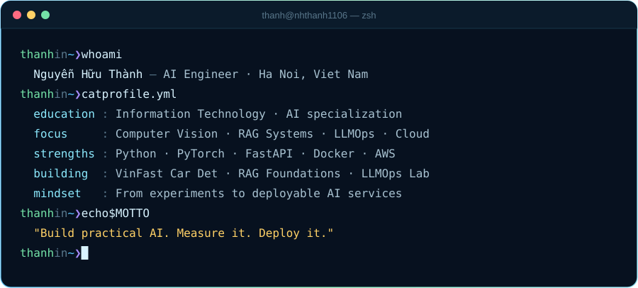

<!-- ============================== HERO ============================== -->

  

  

  
  
  
   
  
  
  

<!-- ============================== ABOUT ============================== -->
## 👋 About Me

I'm an Information Technology engineer in Vietnam, focused on building practical AI systems across **Computer Vision**, **RAG / Retrieval Systems**, **Cloud Deployment**, and **LLMOps**.

My recent work covers the full path from model experimentation to deployable, reliable software: training vision backbones, developing retrieval pipelines, containerizing AI microservices, deploying them on cloud infrastructure, and embedding monitoring, tracing, evaluation, and reliability controls.

  

## ⚡ What I Bring

<table>
  <tr>
    <td width="33%" valign="top">
      <h3>👁️ Computer Vision</h3>
      Object detection, CNN backbones, Faster R-CNN, FPN, image degradation analysis, test-time augmentation (TTA), Soft-NMS and practical model evaluation.
    </td>
    <td width="33%" valign="top">
      <h3>🧠 RAG & Retrieval Systems</h3>
      Chunking strategies, multilingual embeddings, vector stores, benchmark evaluations, prompt engineering, and guardrails for knowledge bases.
    </td>
    <td width="33%" valign="top">
      <h3>☁️ AI Cloud & LLMOps</h3>
      FastAPI services, Docker containers, AWS deployment, Terraform IaC, Langfuse traces, latency percentiles, TTFT, SLOs and incident response.
    </td>
  </tr>
</table>

<!-- ============================== PROJECTS ============================== -->
## 🚀 Featured Projects

<table>
  <tr>
    <td width="50%" valign="top">
      <h3>🚗 <a href="https://github.com/nhthanh1106/FasterRCNN-VinCarDetection">Faster R-CNN VinFast Car Detection</a></h3>
      A PyTorch object-detection project using Faster R-CNN with a ResNet-101 + FPN backbone. Explores mixed-precision training, data augmentation, test-time augmentation (TTA), Soft-NMS, and detection tuning.  
      
      
      
      
    </td>
    <td width="50%" valign="top">
      <h3>🔎 <a href="https://github.com/nhthanh1106/K4-L3B-Data-Foundations">RAG Data Foundations</a></h3>
      A hands-on retrieval pipeline covering document chunking, embeddings, vector stores, and RAG evaluation. Includes multilingual retrieval experiments and benchmarking retrieval strategies on Vietnamese e-commerce policy documents.  
      
      
      
      
    </td>
  </tr>
  <tr>
    <td width="50%" valign="top">
      <h3>☁️ <a href="https://github.com/nhthanh1106/K4-L3B-DAY12-NguyenHuuThanh-2A202602813-CloudServicesAndDeployment">AI Cloud Services & Deployment</a></h3>
      A production-oriented AI API lab covering 12-factor configuration, containerization, API-key security, rate limiting, cost guards, health probes, stateless scaling, and cloud deployment practices.  
      
      
      
      
    </td>
    <td width="50%" valign="top">
      <h3>📊 <a href="https://github.com/nhthanh1106/K4-L3-DAY13-NguyenHuuThanh-2A202602813-Monitoring-LLMOps">Monitoring & LLMOps</a></h3>
      An observability lab for AI services built around the investigation path Metrics → Logs → Traces. Covers correlation IDs, PII-safe logging, latency percentiles, TTFT, token/cost monitoring, Langfuse traces, SLOs, alerts, and incident analysis.  
      
      
      
      
    </td>
  </tr>
</table>

  Also exploring AI evaluation, guardrails, agent workflows, sensor reliability and deep learning systems.

<!-- ============================== TECH ============================== -->
## 🧰 Technical Toolkit

<table align="center">
  <tr>
    <td align="right"><b>Languages</b></td>
    <td></td>
  </tr>
  <tr>
    <td align="right"><b>AI &amp; Vision</b></td>
    <td>
       
      
      
      
      
    </td>
  </tr>
  <tr>
    <td align="right"><b>Backend &amp; API</b></td>
    <td></td>
  </tr>
  <tr>
    <td align="right"><b>Cloud, DevOps &amp; MLOps</b></td>
    <td>
       
      
      
      
    </td>
  </tr>
</table>

<!-- ============================== ACTIVITY ============================== -->
## 📊 GitHub Activity

  
  

  

  

<!-- ============================== CTA ============================== -->

<h2 align="center">Building practical AI, one system at a time.</h2>

  If you're hiring for AI/ML engineering, computer vision or LLMOps roles, I'd be happy to connect.  
  
  

  

